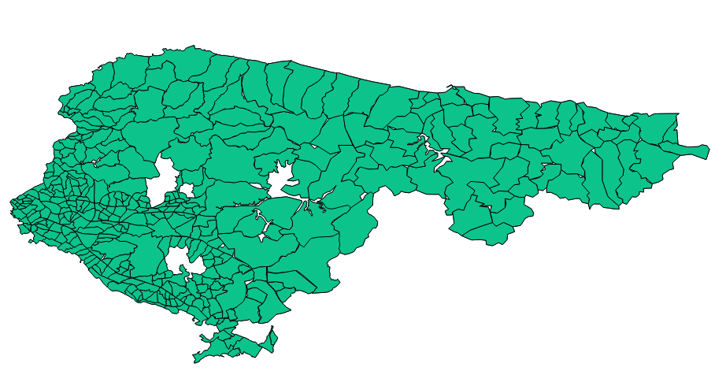

# Data Scientist
```javascript
{
  "firstName": "Süleyman",
  "lastName": "Topdemir",
  "yearOfBirth": 1993,
  "email" : "topdemirsuleyman13@gmail.com",
  "profession" : "Data Scientist",  
}
```
## Works & Projects

### [Master Thesis](https://github.com/stopdemir/Tabu-Search-Implementation)
A Mathematical Model and Application on Prevention of Gerrymandering
- [master thesis](https://research.sabanciuniv.edu/id/eprint/36870/)
<p>
 
  
</p>

### [Gibbs Sampling & EM Algorithm Implementation](https://github.com/stopdemir/Gibbs-Sampling-EM-Algorithm-Implementation-/blob/master/Final%20Report.pdf)
- Gibbs Sampling
- Expectation-Maximization Algorithm
<p>
 
</p>
  
### [Stock Control System](https://github.com/stopdemir/stock-control-system-MS-Access)

- One can enter/delete/retrieve information to the database by using the user interface that has been developed on MS Access
<p>
 
</p>

### [Political Districting Problem](https://github.com/stopdemir/Political-Districting-Problem)
- Demonstrating the detrimental effects of [gerrymandering](https://www.britannica.com/topic/Moore-v-Harper) with mathematical programming
- the model is implemented by using CPLEX Java API
<p>
 
  
</p>

## Work Experience
- Data Scientist, Afiniti
- Teaching Assistant, Sabanci University
- Research Assistant, Sabanci University
- Intern, Turkish Aerospace Industries
- Intern, Tempo Uno Kft.
- Intern, BTA/TAV Airports

## Education
- Industrial Engineering, PhD, Sabanci University
- Industrial Engineering, MSc, Sabanci University
- Industrial Engineering, MSc, Delft University of Technology
- Industrial Engineering, BSc, TOBB University of Economics and Technology
- Natural Sciences, High School, Isparta Suleyman Demirel Science High School

## Achievements
- **Full Scholarship**, Sabanci University, PhD
- **Full Scholarship**, Sabanci University, MSc
- **High Honor Degree**, TOBB University of Economics and Technology, BSc
- **Full Scholarship**, TOBB University of Economics and Technology, BSc
- **in top 0.2%**, National University Entrance Exam

## Programs

- YGA Summit (2018)
- Smartcon Conference (2018)
- Cinema Seminar (2018)
- Smartcon Conference (2017)
- Mathematical Foundations of Machine Learning (2016)
- Unreasonable Labs Turkey sponsored by USA Consulate General (2016)
- Smartcon Conference (2016)
- Endeavor CaseCampus Entrepreneurship Program sponsored by JP Morgan (2015)

