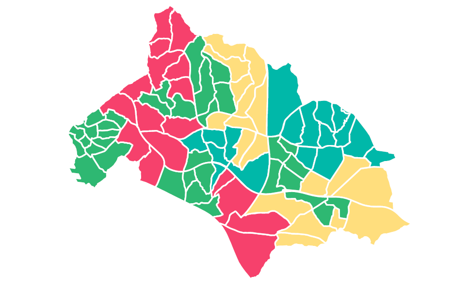

# Data Scientist
<hr>
```javascript
{
  "firstName": "Süleyman",
  "lastName": "Topdemir",
  "yearOfBirth": 1993,
  "email" : "topdemirsuleyman13@gmail.com",
  "profession" : "Data Scientist",  
}
```
## Works & Projects


### [Master Thesis](https://research.sabanciuniv.edu/id/eprint/36870/)
<p>
 <a href="https://github.com/stopdemir/Tabu-Search-Implementation">
  
 </a>
</p>
- A Mathematical Model and Application on Prevention of Gerrymandering
- Developed an analytical approaches in order to show the detrimental effects of a malpractise named gerrymandering
- Several technologies have been used such as CPLEX Java API, R, QGIS.
- A Mixed-Integer Mathematical Model developed and solved optimally for relatively small cases
- A Tabu search algorithm has been employed for relatively large cases
<p align="center">
 
</p>
<hr>

### [A Machine Learning Study on a Finance Dataset](https://nbviewer.org/github/stopdemir/Machine-Learning-Study/blob/main/Machine_Learning_Work.ipynb)
<p>
 <a href="https://nbviewer.org/github/stopdemir/Machine-Learning-Study/blob/main/Machine_Learning_Work.ipynb">
  
 </a>
 <a href="https://github.com/stopdemir/Tabu-Search-Implementation">
  
 </a>
</p>
- Several Machine Learning Techniques
- Feature Engineering
- Dimensionality Reduction and Visualization of a High Dimensional Dataset
  

<hr>

### [Descriptive Data Analysis on an Ecommerce Dataset](https://github.com/stopdemir/ecommerce-data-analysis)
<p>
 <a href="https://github.com/stopdemir/ecommerce-data-analysis">
  
 </a>
</p>
- A Descriptive Statistical Data Analysis
- Ecommerce Dataset
- Funnel Analysis 
<p align="center">
 
</p>
<hr>

### [Recognizing Handwritten Digits by using Artificial Neural Network](https://github.com/stopdemir/Recognizing-Handwritten-Digits-by-using-Artificial-Neural-Network/blob/main/Report%20Neural%20Network.pdf)
<p>
 <a href="https://github.com/stopdemir/Recognizing-Handwritten-Digits-by-using-Artificial-Neural-Network/blob/main/Report%20Neural%20Network.pdf">
  
 </a>
</p>
- Matlab Implementation of a Feed Forward Neural Network 
- on MNIST Dataset
<p align="center">
 
</p>
<hr>

### [Gibbs Sampling & EM Algorithm Implementation](https://github.com/stopdemir/Gibbs-Sampling-EM-Algorithm-Implementation-/blob/master/Final%20Report.pdf)
<p>
 <a href="https://github.com/stopdemir/Gibbs-Sampling-EM-Algorithm-Implementation-/blob/master/Final%20Report.pdf">
  
 </a>
</p>
- Gibbs Sampling
- Expectation-Maximization Algorithm
<p align="center">
 
</p>
<hr>

### [Stock Control System](https://github.com/stopdemir/stock-control-system-MS-Access)
<p>
 <a href="https://github.com/stopdemir/stock-control-system-MS-Access">
  
 </a>
</p>
- The user interface developed on MS Access allows users to effortlessly enter, delete, and retrieve information from the database
<p align="center">
 
</p>
<hr>

### [Political Districting Problem](https://github.com/stopdemir/Political-Districting-Problem)
<p>
 <a href="https://github.com/stopdemir/Political-Districting-Problem">
  
 </a>
</p>
- Demonstrating the detrimental effects of [gerrymandering](https://www.britannica.com/topic/Moore-v-Harper) with mathematical programming
- the model is implemented by using CPLEX Java API
<p align="center">
 
  
</p>
<hr>

## Work Experience
- Data Scientist, Afiniti (2021-2022)
- Teaching Assistant, Sabanci University (2016-2021)
- Research Assistant, Sabanci University (2017)
- Intern, Turkish Aerospace Industries (2016)
- Intern, Tempo Uno Kft. (2015)
- Intern, BTA/TAV Airports (2014)
<hr>

## Education
- Industrial Engineering, PhD, Sabanci University (2019-2021 Dropout)
- Engineering and Policy Management, MSc, Delft University of Technology (Erasmus+ 2017)
- Industrial Engineering, MSc, Sabanci University (2016-2019)
- Industrial Engineering, BSc, TOBB University of Economics and Technology (2011-2016)
- Natural Sciences, High School, Isparta Süleyman Demirel Science High School (2007-2011)
<hr>

## Achievements
- **Full Scholarship**, Sabanci University, PhD
- **Full Scholarship**, Sabanci University, MSc
- **High Honor Degree**, TOBB University of Economics and Technology, BSc
- **Full Scholarship**, TOBB University of Economics and Technology, BSc
- **in top 0.2%**, National University Entrance Exam


